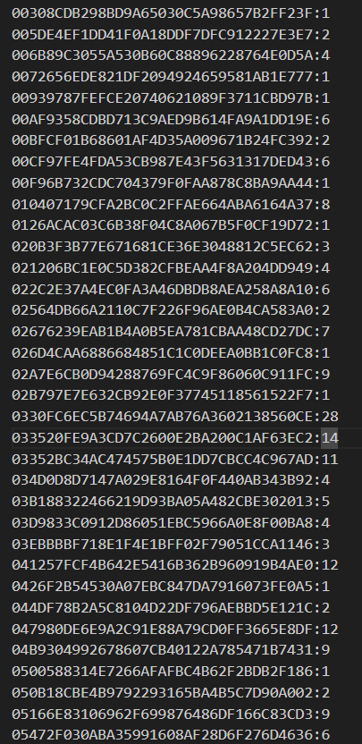
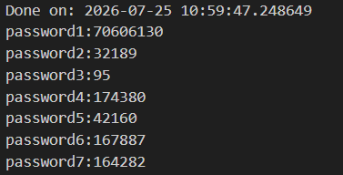
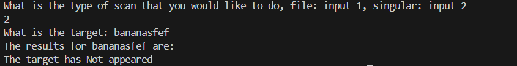
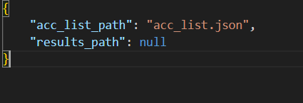
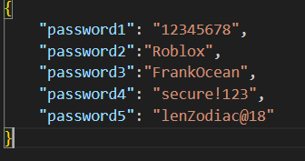

# Password breach checker

This markdown file is the documentation for my python project concerning automation with python, cybersecurity and API application.

My Password Breach Checker is a Python CLI tool that securely checks for password breaches using the Have I Been Pwned Passwords API using the k-Anonymity model. Passwords are hashed locally, and only the first five characters of the SHA-1 hash are transmitted, ensuring plaintext passwords never leave the user's machine, this was done to comply with HIBP API usage requirements.

For any more information on the code itself, several comments have been left thhroughout the python file

## How does it work?

My project takes in a json file consisting of passwords and references to the passwords, each entry in the json file is hashed and only the first 5 characters (This is the prefix, the remaining characters are the suffix) are sent to the HIBP API passwords endpoint in a manner which complies with the K-Anonymity model. Once the response is recieved from the API, each line in the response is checked for whether or not it matches the hash of the suffix.

An example of a returned response from the HIBP API:



From the list above, all returned suffix are then compared with the suffix of the password being checked for breaches. If a match is found then the integer after the ":", is taken as this is the number of times the password has appeared in breaches. This integer is then recorded into a text file, in the following format



### TLDR

The application accepts a JSON file containing account references and their associated passwords.

Each password undergoes the following process:

1. The password is hashed locally using SHA-1.
2. The first five characters (The prefix) are sent to the HIBP Passwords API.
3. The API returns every matching hash suffix associated with that prefix.
4. The application compares each returned suffix against the suffix of the locally generated password hash.
5. If a match is found, the number following the colon (`:`) represents the number of times the password has appeared in known data breaches.
6. The result is then written to a results file.

## How to use it

This project when run contains 2 options:

- option 1: This makes use of a list of passwords to perform batch scanning
- option 2: This allows the user to type a password into the CLI when prompted, scanning just that input

The first option will lead to the configuration file named "config.json" being searched for and the its contents will be checked before any request to the HIBP API is made.

The second option will return the value to stdout, in most cases, the terminal. If no matches were found then no number is returned and a string informing that no matches were found is shown, for example



### Configuration file

The application stores its configuration in the json file **config.json**.

The default configuration is:



The configuration file contains two keys:

- acc_list_path – Path to the JSON file containing the account list.
- results_path – Directory where scan results will be written.

Only the values of these keys should be modified as renaming or removing the keys will cause the configuration validation process to fail. In such cases, the application will either restore the default configuration or prompt the user with the option to allow them to manually create the configuration file or for the script itself to create a default configuration

### account list file

The file holding the list of accounts must be a correctly formatted JSON file, if not then as expected an error will be shown or the results will not be displayed in a desireable manner

The correct format is as follows:



## Requirements

For this script to run you ill require the following modules installed along with an up to date version of python3:

- Requests Module, installed with the following command

```bash
python -m pip install requests
```

- Hashlib Module, comes standard with latest versions of python

- Pathlib Module, comes standard with latest versions of python

- Json Module, comes standard with latest versions of python

- Time Module, comes standard with latest versions of python

- Datetime Module, comes standard with latest versions of python

## Future Improvements

As time progresses and my skills improve I will look into this project again and make several improvements, such as:

- Command-line argument support using the module `argparse`
- Additional error reporting
- facilitating the option to make the script a cron jon
- Optional asynchronous requests for improved performance

## License

My project is intended for educational and portfolio purposes.

The Have I Been Pwned API remains the property of its respective owner and is used in accordance with its published API guidelines.
